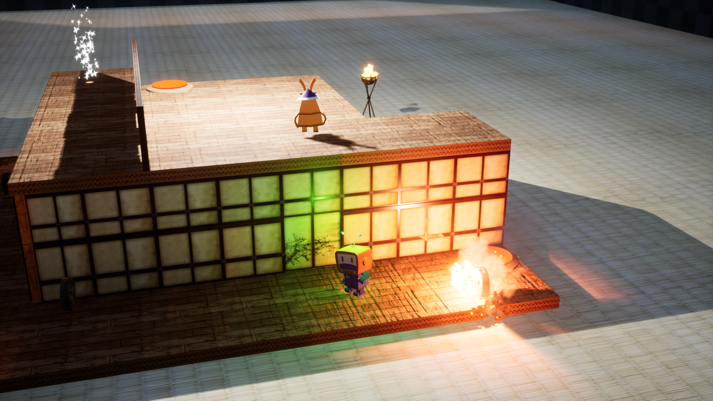

# GameStudy-UE4-PaperNinja
페이퍼 닌자 게임 ( 실전 게임 제작으로 배우는 언리얼 엔진 4 - 한빛 미디어 )

### 개발기간 🏗️
* 2021.01.04~01.20 (16일)

### 기술 📚
* UE4 (BluePrint)

### 배운 것 📖
* Game System
* enemy AI
  * BehaviorTree (BP)
  * line casting
* animation (BP)
* particle system (BP)
* mesh & texture (BP)
* Damage System
